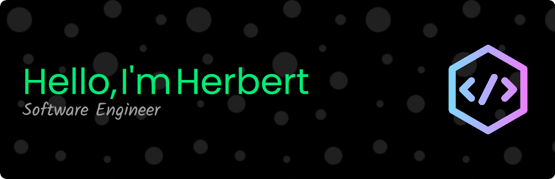

<!--
### Hello 👋
I'm Herbert.

   -->

- 👨‍🎓 Computer Science Student at Kyungpook National University.
- 🌐 Software Engineer.
- 🚀 Passionate about Coding and Problem Solving.
- 🤖 Exploring the World of Machine Learning. )   

<!--
**Getsug/Getsug** is a ✨ _special_ ✨ repository because its `README.md` (this file) appears on your GitHub profile.

Here are some ideas to get you started:

- 🔭 I’m currently working on ...
- 🌱 I’m currently learning ...
- 👯 I’m looking to collaborate on ...
- 🤔 I’m looking for help with ...
- 💬 Ask me about ...
- 📫 How to reach me: ...
- 😄 Pronouns: ...
- ⚡ Fun fact: ...
-->
    

<!--
### 🌱 Currently Learning 
I’m currently learning and working on exciting projects to further enhance my skills.
-->

<!--
### 🚀 Here's a glimpse of what you can find on my GitHub:

🔧 Featured Repositories
[Fashion Model](https://github.com/Getsug/fashion-model) 
Project 1 Name - Highlight any personal or academic projects that demonstrate your skills and interests.

🤖 Machine Learning

[Fashion Model](https://github.com/Getsug/fashion-model) 
Machine Learning Project 2 - Share your passion for machine learning with details on your latest experiments.
-->

### 🌟 Let's Collaborate

I'm always open to collaboration on exciting projects or simply discussing technology and its impact on our world. Feel free to reach out to me through my social media profile.

    ✈ Check out my repositories and let's make a difference through technology!

